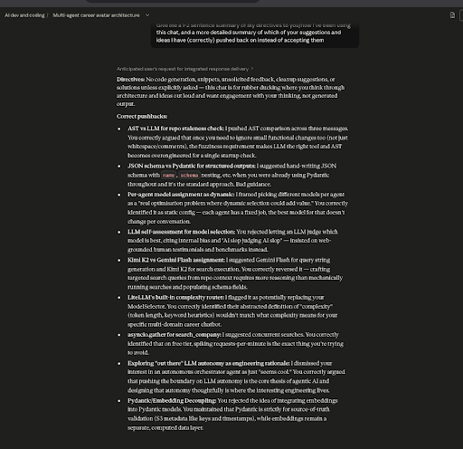

# Personal WIP: Multi-Agent Career Avatar Chatbot

**NOTE: This repo contains incomplete code for an in-progress personal project for a multi-agent career avatar chatbot, rather than production code!**

--- 

I use AI assistants and tools in my coding workflow. I believe in generously using the resources available to you to maximise efficiency, and it's 2026. I also take a handful of hours out of my week to do something a bit different: work on code for a side-project where I write and think about things from scratch, but use a dedicated AI project (preconfigured with explicit instructions not to generate code or provide solutions/suggestions unless explicitly asked) as a rubber ducky, where I deep-dive into architectural design/scalability/robustness and spend an obscene amount of time getting under the hood of why and how certain code choices are made/are working the way they are. I'll engage in a dialectical process with the model, push back often, and come away with a deeper understanding of my own practices. More often than not, I love making my life even harder by forgoing even basic linters to catch a better glimpse of my oversights and error patterns to prevent them from becoming ossified. 

A screenshot of the Opus 4.6 chat I used as a rubber ducky, with a summary of our 'argument' and my pushbacks:

  

Why do all this, you may ask? This is in part driven by my own nagging worry about not developing my own architectural and design skills adequately enough, and in part by how much fun I have while doing this. It's also been a fantastic way to study the failure modes of LLMs when it comes to generating code, which comes in handy when watching for patterns of bugs, loss of robustness or security, or plain bad design in code generated by LLM-based tools ('OOP? I don't know who this man is–sorry to this man'). We're seeing catastrophic failures arising from LLM-generated code in various domains, and I think using them responsibly involves beefing up our own acumen for surveilling and auditing AI-generated code.

---

I've been working quite a bit with agentic AI patterns and workflows, so I'm quite familiar with deploying tool calls and setting up agents. However, I really wanted to get under the hood–beyond the abstractions of frameworks–to analyse every moving part behind tool calls and agent orchestrations, and really reconstruct the workflow piece-by-piece to come away with a deeper understanding of agentic AI. As someone who has worked in various domains and on different fronts (biomedical sciences, AI, NLP, pure tech, healthtech, product and strategy–among others), I decided to start putting together a multi-agent career avatar chatbot that can both represent my career persona _and_ adapt tone and contextual information tailored to who is asking and for what role–on the fly.  I also love putting together projects under low-to-no-resource constraints, so this project involves using only free LLM APIs combined with load balancing techniques and handling for rate/token limits (I'd never do this for production–the latency itself would be a dealbreaker!). Along the way, it was inevitable that I would start thinking about robustness, scalability, resource management and higher-level design principles–despite initially setting out to do a simple boilerplate multi-agent workflow. This personal project has ended up sprawling into the following capabilities and components, among others:

- Multi-agent orchestrator with sequential and hierarchical (autonomous LLM-managed) execution modes, designed to balance latency constraints against response quality across free-tier providers
- Web-grounded model research agent that benchmarks and profiles available LLMs per use case, with LLM-based repo staleness detection to avoid redundant reruns; per-turn dynamic model selector ranks models by cost-efficiency, task complexity, and domain fit, feeding ranked lists into LiteLLM's Router for load balancing, failover, and cooldown management across Groq and Gemini free tiers
- LLM config registry with per-provider API path handling, rate limit metadata, and fallback routing for unavailable models
- Dual tool architecture: handrolled JSON definitions + async function implementations for no-framework agentic workflows, plus SDK-wrapped versions via OpenAI Agents SDK Tool class — both driven from a single auto-constructed registry, demonstrating both mechanical understanding and framework-level usage
- Async tool functions with Exa (semantic search with company category disambiguation) and Linkup fallback, tenacity retry with exponential backoff, separate try/except per search call to preserve partial results and maximise robustness against transient failures
- Company search with two-pass strategy (entity-focused + culture/team-focused) and role requirements search with per-role iteration and company/industry context narrowing for disambiguation
- Tone tailoring and opportunity research agents that run once per session after gathering user/role/company context, calibrating response voice based on template letters, company culture, and user role to produce domain-appropriate, personalised responses
- S3 bucket integration (IAM-scoped, private) for sensitive career documents with boto3 loader
- Redis vector DB with HNSW indexing for reduced search latency, delta-aware sync (only re-embeds documents with newer S3 timestamps, drops stale chunks), async operations via AsyncSearchIndex for non-blocking I/O
- Hybrid RAG retrieval with weighted vector blending (0.75 latest message / 0.25 conversation summary), BM25+vector linear combination, configurable reranking (HF cross-encoder or FlashRank), and Redis semantic caching to minimise redundant retrieval and reduce latency on repeated or similar queries
- Pydantic schemas throughout for structured LLM outputs: model profiles, model rankings, opportunity research, response evaluation, repo similarity, S3 metadata
- Lazy initialisation module handling first-message triggers: concurrent vectorDB build + model research via asyncio.TaskGroup to front-load setup latency; user role info detection gates downstream opportunity research and tone tailoring
- Response evaluator agent with pass/fail + feedback loop back to response generator for iterative quality control
- Conversation summarisation for RAG query construction, with prompt caching planned for reused static documents
- Gradio Blocks UI with per-user browser state and SQLiteSession for OpenAI SDK agent compatibility; push notifications via Pushover for recording user details and unknown questions